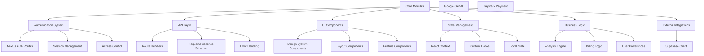

# Comprehensive Documentation Implementation Plan for Catalyst Codebase

## Executive Summary

This plan outlines a systematic approach to document the **Catalyst Workspace Studio** - a Next.js 16.1.6 application with TypeScript, React 19, Supabase integration, and AI-powered features. The codebase contains ~140 TypeScript/TSX files across authentication, API routes, UI components, and business logic modules.

---

## 1. Codebase Analysis Strategy

### 1.1 Systematic Exploration Approach

**Phase 1: Architecture Mapping (Week 1)**
```
└── Architecture Discovery
    ├── Directory structure analysis (app/, components/, lib/, api/)
    ├── Module dependency mapping
    ├── Data flow analysis (Supabase -> API -> Components)
    ├── External integration points (Google GenAI, Paystack, Stripe)
    └── Build & deployment pipeline
```

**Phase 2: Module Deep-Dive (Week 2)**


**Phase 3: Function & Class Cataloging (Week 3)**
- **Automated scanning** using TypeScript compiler API
- **Manual review** of complex business logic
- **Interface & type extraction** for API documentation
- **Component prop documentation** extraction

### 1.2 Analysis Tools & Methods

| Tool/Method | Purpose | Output |
|-------------|---------|--------|
| `tsc --noEmit` | Type checking & symbol extraction | Type definitions, interfaces |
| `madge` | Dependency visualization | Module dependency graphs |
| Custom scripts | Function signature extraction | Function catalog |
| Code reading sessions | Deep understanding | Architectural notes |
| Runtime inspection | API endpoint testing | Integration documentation |

### 1.3 Key Areas of Focus

**High-Priority Modules:**
1. **Authentication System** (`app/(auth)/`) - Next.js auth routes, session management
2. **API Layer** (`app/api/`) - 15+ route handlers for analysis, billing, settings
3. **Studio Core** (`app/studio/`) - AI-powered workspace features
4. **Design System** (`app/components/`) - GlassPanel, tokens, reusable UI
5. **State Management** (`app/context/`, `app/hooks/`) - React context, custom hooks
6. **External Integrations** - Supabase, Google GenAI, Paystack

**Critical Functions to Document:**
- Analysis pipeline (prompt -> AI -> response)
- Billing and subscription management
- User settings and preferences
- History and session management
- Design token system (Glass & Neon aesthetic)

---

## 2. Documentation Scope & Types

### 2.1 Documentation Type Matrix

| Type | Audience | Purpose | Priority | Format |
|------|----------|---------|----------|--------|
| **Architectural Overview** | Developers, Tech Leads | System structure, design decisions | High | Markdown |
| **API Reference** | Backend Devs, Integrators | Endpoint specs, schemas, examples | High | OpenAPI/Swagger |
| **Component Library** | Frontend Devs | UI components, props, usage | High | Storybook + Markdown |
| **Setup Guide** | New Contributors | Development environment setup | High | Markdown |
| **User Guides** | End Users | Feature usage, tutorials | Medium | Markdown |
| **Contributor Guidelines** | Open Source Contributors | Coding standards, PR process | Medium | Markdown |
| **Design System** | Designers, Frontend Devs | Visual tokens, component specs | Medium | Markdown + Figma |
| **Deployment Guide** | DevOps | Production deployment | Medium | Markdown |
| **Integration Guides** | Third-party Devs | API consumption patterns | Low | Markdown |
| **Changelog** | All Stakeholders | Version history, breaking changes | High | Markdown |

### 2.2 Priority Classification

**Tier 1 (Critical - Week 1-2):**
- Architectural Overview
- API Reference (internal endpoints)
- Setup Guide
- Contributor Guidelines

**Tier 2 (Important - Week 3-4):**
- Component Library Documentation
- Design System Reference
- User Guides (core features)
- Deployment Guide

**Tier 3 (Nice-to-Have - Week 5+):**
- Integration Guides
- Advanced Tutorials
- Migration Guides

---

## 3. Tooling & Format Recommendations

### 3.1 Tool Stack Selection

| Documentation Type | Recommended Tool | Rationale |
|-------------------|------------------|-----------|
| **API Documentation** | [tRPC](https://trpc.io) + OpenAPI | Type-safe API docs, auto-generated from code |
| **Component Docs** | [Storybook](https://storybook.js.org) | Interactive component catalog |
| **Code Comments** | TypeScript JSDoc + [TypeDoc](https://typedoc.org) | Type-aware code documentation |
| **General Docs** | [Nextra](https://nextra.site) (Next.js + MDX) | Integrated with existing Next.js setup |
| **Static Site** | [Docusaurus](https://docusaurus.io) or Nextra | Professional docs site |
| **Diagrams** | [Mermaid](https://mermaid.js.org) + [Excalidraw](https://excalidraw.com) | Code-based diagrams, visual explanations |
| **Versioning** | Git + [Release Please](https://github.com/google-github-actions/release-please-action) | Automated changelog generation |

### 3.2 Format Standards

**Markdown Conventions:**
```markdown
# H1 - Document Title
## H2 - Section
### H3 - Subsection
#### H4 - Sub-subsection

- Use fenced code blocks with language specification
- Use tables for structured data
- Use Mermaid for diagrams
- Frontmatter for metadata (title, description, sidebar position)
```

**TypeScript Documentation:**
```typescript
/**
 * Analyzes user prompt using configured AI model
 *
 * @param prompt - User input text to analyze
 * @param options - Analysis configuration options
 * @param options.model - AI model to use (default: configured default)
 * @param options.template - Optional prompt template
 * @returns Promise<AnalysisResult> - Structured analysis response
 *
 * @example
 * ```typescript
 * const result = await analyzePrompt("Explain quantum computing", {
 *   model: "claude-3-5-sonnet"
 * });
 * ```
 *
 * @throws {AnalysisError} - When AI provider returns an error
 */
async function analyzePrompt(
  prompt: string,
  options?: AnalysisOptions
): Promise<AnalysisResult>
```

**API Endpoint Documentation:**
```yaml
# OpenAPI/Swagger format
paths:
  /api/analyze:
    post:
      tags: [Analysis]
      summary: Analyze user prompt
      requestBody:
        content:
          application/json:
            schema:
              $ref: '#/components/schemas/AnalysisRequest'
      responses:
        '200':
          description: Analysis completed
          content:
            application/json:
              schema:
                $ref: '#/components/schemas/AnalysisResponse'
        '401':
          $ref: '#/components/responses/Unauthorized'
        '429':
          $ref: '#/components/responses/RateLimited'
```

### 3.3 Tooling Implementation Plan

**Week 1: Foundation Setup**
```bash
# Install documentation tools
pnpm add -D typedoc storybook @storybook/nextjs mermaid

# Initialize Nextra (if using standalone docs)
npx create-nextra@latest docs --tsx
```

**Week 2: Automation Configuration**
```yaml
# .github/workflows/docs.yml
name: Documentation
on:
  push:
    branches: [main, develop]
  pull_request:
    branches: [main]

jobs:
  build-docs:
    runs-on: ubuntu-latest
    steps:
      - uses: actions/checkout@v4
      - uses: pnpm/action-setup@v2
      - run: pnpm install
      - run: pnpm run docs:build
      - uses: actions/upload-pages-artifact@v3

  deploy-docs:
    needs: build-docs
    if: github.ref == 'refs/heads/main'
    runs-on: ubuntu-latest
    permissions:
      pages: write
      id-token: write
    environment: github-pages
    steps:
      - uses: actions/deploy-pages@v4
```

---

## 4. Content Creation Strategy

### 4.1 Information Source Identification

**Primary Sources:**
| Source | Information Type | Extraction Method |
|--------|-----------------|-------------------|
| TypeScript files | Types, interfaces, functions | `tsc`, `typedoc` |
| API route files | Endpoints, schemas | Manual + automated |
| Component files | Props, usage examples | Storybook + manual |
| DESIGN.md | Visual tokens, aesthetics | Manual consolidation |
| .env files | Configuration requirements | Manual |
| package.json | Dependencies, scripts | Manual |
| Git history | Change context | `git log`, conventional commits |

**Secondary Sources:**
- Supabase dashboard (database schema)
- Google GenAI documentation (integration details)
- Paystack API documentation (payment flow)
- Existing README.md files

### 4.2 Writing Guidelines

**Content Standards:**
1. **Clarity First**: Explain concepts simply before diving into details
2. **Code Examples**: Every API endpoint and function must have usage examples
3. **Contextual Links**: Cross-reference related documentation
4. **Version Awareness**: Note when features were introduced/deprecated
5. **Audience Targeting**: Clearly mark developer vs. user content

**Style Guide:**
- **Tone**: Professional, concise, friendly
- **Voice**: Active voice ("Call the function" not "The function should be called")
- **Sentence Structure**: Short paragraphs, bullet points for lists
- **Code Formatting**: Consistent indentation (2 spaces), proper syntax highlighting
- **Terminology**: Use existing codebase terms (e.g., "Glass Panel" not "Card")

### 4.3 Review Process

**Quality Assurance Checklist:**
- [ ] All code examples compile/run
- [ ] All links work (internal and external)
- [ ] Spelling and grammar checked
- [ ] Consistent formatting
- [ ] Accurate technical information
- [ ] Appropriate for target audience
- [ ] Cross-references are bidirectional

**Review Workflow:**
```
Author -> Self-Review -> Peer Review -> Technical Review -> Approval -> Merge
       (24h)         (24-48h)      (24h)            (Final)
```

### 4.4 Content Creation Timeline

| Week | Focus Area | Deliverables | Responsible |
|------|-----------|--------------|-------------|
| 1 | Architecture, Setup | Arch overview, setup guide, contributor docs | Tech Lead |
| 2 | API Layer | OpenAPI spec, endpoint docs | Backend Dev |
| 2 | Components | Storybook setup, component docs | Frontend Dev |
| 3 | User Features | User guides, tutorials | Tech Writer |
| 3 | Design System | DESIGN.md expansion, token reference | Designer + Frontend |
| 4 | Integration | Integration guides, examples | Tech Lead |
| 4 | Polish | Cross-references, search, navigation | All |

---

## 5. Structure & Organization

### 5.1 Documentation Site Structure

```
/docs
├── .nextra/                  # Nextra build output
├── public/                   # Static assets
│   └── diagrams/             # Mermaid diagrams, images
├── components/               # Reusable MDX components
│   ├── CodeBlock.tsx
│   ├── ApiEndpoint.tsx
│   ├── ComponentPreview.tsx
│   └── Callout.tsx
├── _app.tsx                  # Nextra app configuration
├── _document.tsx             # Document layout
├── theme.config.tsx          # Theme (matches Catalyst Glass & Neon)
├── architecture/
│   ├── index.md              # Architecture overview
│   ├── data-flow.md          # System data flow
│   ├── module-map.md         # Module dependencies
│   └── technology-stack.md   # Tools and libraries
├── getting-started/
│   ├── index.md              # Quick start
│   ├── installation.md       # Setup instructions
│   ├── configuration.md      # Environment setup
│   └── troubleshooting.md    # Common issues
├── development/
│   ├── index.md              # Development guide
│   ├── coding-standards.md   # Code style, conventions
│   ├── testing.md            # Testing strategy
│   ├── debugging.md          # Debug tips
│   └── deployment.md         # Deployment instructions
├── api/
│   ├── index.md              # API overview
│   ├── authentication.md     # Auth endpoints
│   ├── analysis.md           # Analysis endpoints
│   ├── billing.md            # Billing endpoints
│   ├── settings.md           # Settings endpoints
│   └── webhooks.md           # Webhook specs
├── components/
│   ├── index.md              # Component library
│   ├── design-system.md      # Glass & Neon tokens
│   ├── layout/               # Layout components
│   ├── ui/                   # UI components
│   └── features/             # Feature components
├── features/
│   ├── index.md              # Feature overview
│   ├── studio.md             # Studio workspace
│   ├── analysis.md           # Analysis engine
│   ├── history.md            # History management
│   └── settings.md           # User settings
├── integrations/
│   ├── index.md              # Integration overview
│   ├── supabase.md           # Database integration
│   ├── google-genai.md       # AI provider
│   └── paystack.md            # Payment processing
├── reference/
│   ├── types.md              # TypeScript type reference
│   ├── hooks.md              # Custom React hooks
│   ├── utilities.md          # Utility functions
│   └── constants.md          # Application constants
├── contributing/
│   ├── index.md              # Contribution guide
│   ├── code-review.md        # PR review process
│   ├── issue-templates.md    # Bug/feature templates
│   └── release-process.md    # Version releases
└── changelog/
    ├── index.md              # Changelog
    └── [version]/
        └── index.md          # Individual release notes
```

### 5.2 Navigation Hierarchy

**Main Sidebar:**
```
Catalyst Documentation
├── 🏗️ Architecture
├── 🚀 Getting Started
├── 💻 Development
├── 🔌 API Reference
├── ⚛️ Components
├── ✨ Features
├── 🔗 Integrations
├── 📚 Reference
├── 🤝 Contributing
└── 📜 Changelog
```

**Feature-Specific Navigation:**
Each major section includes:
- Overview page with table of contents
- Conceptual explanations
- Practical examples
- Troubleshooting tips
- Related links

### 5.3 URL Structure

Clean, predictable URLs following RESTful conventions:

```
/docs/architecture
/docs/getting-started/installation
/docs/api/analysis
/docs/components/ui/GlassPanel
/docs/features/studio
/docs/integrations/supabase
```

### 5.4 Cross-Reference Strategy

**Internal Linking:**
- Use relative MDX links: `[Glass Panel](./components/ui/GlassPanel.mdx)`
- Maintain a `docs.json` index for search
- Implement previous/next navigation

**See Also Sections:**
Every page ends with:
```markdown
## See Also

- [API Analysis Endpoint](/docs/api/analysis)
- [Studio Feature Guide](/docs/features/studio)
- [Supabase Integration](/docs/integrations/supabase)
```

---

## 6. Maintenance & Versioning

### 6.1 Documentation Lifecycle

**Creation -> Review -> Publication -> Maintenance -> Archival**

**Maintenance Workflow:**
1. **Code Change Trigger**: PRs that modify documented code
2. **Documentation Update**: Corresponding docs updated in same PR
3. **Review Verification**: Docs reviewed alongside code
4. **Automated Checks**: CI validates docs completeness
5. **Periodic Audits**: Quarterly documentation reviews

### 6.2 Synchronization Strategies

**Strategy 1: Code-First Documentation (Recommended)**
```typescript
// Function with JSDoc
/**
 * @documentation required
 */
function criticalFunction() {}

// CI check: Ensure all `@documentation required` items have docs
```

**Strategy 2: Documentation-First**
- Require documentation before code review
- Use PR templates with documentation checklist

**Strategy 3: Automated Generation**
```yaml
# typedoc.json
{
  "entryPoints": ["app/lib/**/*.ts", "app/api/**/*.ts"],
  "out": "docs/reference/types",
  "exclude": ["**/*.spec.ts", "**/node_modules/**"]
}
```

**Strategy 4: Living Documentation**
- Embed documentation in code (JSDoc)
- Generate static docs from code
- Keep single source of truth

### 6.3 Version Control Integration

**Branch Strategy:**
```
main       - Stable docs (matches production)
develop    - Latest docs (matches staging)
feature/*  - Work in progress docs
docs/*     - Documentation-only changes
```

**Commit Message Conventions:**
```
feat(docs): add API reference for analysis endpoint
fix(docs): correct typos in setup guide
docs: update component props for GlassPanel
chore(docs): configure typedoc for type generation
```

**Git Hooks:**
```bash
# .husky/pre-commit
pnpm lint
pnpm run docs:validate
```

### 6.4 Automation Pipeline

**CI/CD Workflow:**
```yaml
# .github/workflows/docs-ci.yml
name: Docs CI

on: [push, pull_request]

jobs:
  validate:
    runs-on: ubuntu-latest
    steps:
      - uses: actions/checkout@v4
      - uses: pnpm/action-setup@v2
      - run: pnpm install

      # Check for missing documentation
      - run: pnpm run docs:check

      # Validate links
      - run: pnpm run docs:links

      # Spell check
      - run: pnpm run docs:spellcheck

      # Build docs to ensure no errors
      - run: pnpm run docs:build
```

**Automated Documentation Tasks:**
| Task | Tool | Trigger | Frequency |
|------|------|---------|-----------|
| TypeDoc generation | TypeDoc | CI | On every push |
| API spec generation | tRPC/OpenAPI | CI | On every push |
| Storybook build | Storybook | CI | On every push |
| Link validation | markdown-link-check | CI | On every push |
| Spell checking | cspell | CI | On every push |
| Docs site deployment | GitHub Pages | CD | On main merge |

### 6.5 Versioning Strategy

**Semantic Versioning for Documentation:**
- **Major**: Breaking changes in documented APIs
- **Minor**: New documented features
- **Patch**: Documentation improvements, fixes

**Changelog Management:**
- Use [Release Please](https://github.com/google-github-actions/release-please-action) for automated changelog
- Manual entries for significant documentation changes
- Link to related PRs and issues

```yaml
# .github/workflows/release-please.yml
name: Release Please

on:
  push:
    branches: [main]

jobs:
  release-please:
    runs-on: ubuntu-latest
    steps:
      - uses: google-github-actions/release-please-action@v4
        with:
          release-type: node
          package-name: catalyst-docs
          token: ${{ secrets.GITHUB_TOKEN }}
```

### 6.6 Documentation Quality Metrics

**Tracked Metrics:**
- **Coverage**: % of public APIs/components documented
- **Freshness**: Days since last update per section
- **Accuracy**: Number of reported issues/errors
- **Completeness**: Required sections present (examples, params, returns)
- **Accessibility**: WCAG compliance score

**Dashboard:**
```markdown
## Documentation Health

| Metric | Current | Target | Status |
|--------|---------|--------|--------|
| API Coverage | 85% | 100% | 🟡 |
| Component Coverage | 70% | 95% | 🟡 |
| Average Freshness | 14 days | 30 days | 🟢 |
| Reported Issues | 3 | 0 | 🔴 |
| Build Success Rate | 99% | 100% | 🟢 |
```

---

## Implementation Roadmap

### Phase 1: Foundation (Weeks 1-2)

**Week 1:**
- [ ] Set up documentation infrastructure (Nextra/Docusaurus)
- [ ] Configure TypeDoc for type documentation
- [ ] Create documentation site theme (matching Catalyst Glass & Neon)
- [ ] Write architectural overview
- [ ] Document setup and configuration

**Week 2:**
- [ ] Set up Storybook for component documentation
- [ ] Configure OpenAPI/Swagger for API docs
- [ ] Write contributor guidelines
- [ ] Create coding standards document
- [ ] Set up CI/CD for documentation

### Phase 2: Core Documentation (Weeks 3-4)

**Week 3:**
- [ ] Document all API endpoints
- [ ] Document core components (GlassPanel, Header, etc.)
- [ ] Write user guides for main features
- [ ] Document design system tokens
- [ ] Create integration guides

**Week 4:**
- [ ] Document remaining components
- [ ] Write feature-specific user guides
- [ ] Document state management and hooks
- [ ] Create deployment guide
- [ ] Add troubleshooting section

### Phase 3: Polish & Maintenance (Weeks 5-6)

**Week 5:**
- [ ] Add cross-references throughout
- [ ] Implement search functionality
- [ ] Create diagrams for complex flows
- [ ] Review and edit all content
- [ ] Set up documentation preview environment

**Week 6:**
- [ ] Final review and testing
- [ ] Deploy documentation site
- [ ] Announce to team
- [ ] Set up maintenance processes
- [ ] Train team on documentation standards

---

## Resource Requirements

### Team Roles
| Role | Responsibility | Time Commitment |
|------|---------------|-----------------|
| **Documentation Lead** | Overall coordination, final reviews | 20% FTE |
| **Technical Writers** | Content creation, editing | 40% FTE (2 people) |
| **Tech Lead** | Architecture docs, technical accuracy | 10% FTE |
| **Frontend Dev** | Component docs, Storybook | 15% FTE |
| **Backend Dev** | API docs, integration guides | 15% FTE |
| **Subject Matter Experts** | Feature-specific reviews | 5% FTE each |

### Budget
| Item | Cost | Notes |
|------|------|-------|
| Documentation Tools | $0 | Open source (Nextra, TypeDoc, Storybook) |
| Hosting | $0 | GitHub Pages |
| Design Assets | $0 | Use existing Catalyst design system |
| Training | $2,000 | Optional technical writing workshop |
| **Total** | **$2,000** | One-time cost |

### Timeline
- **Total Duration**: 6 weeks
- **Initial docs live**: End of Week 2
- **Complete documentation**: End of Week 6
- **Maintenance**: Ongoing (5% team capacity)

---

## Success Criteria

### Quantitative Metrics
- [ ] 100% of public APIs documented with examples
- [ ] 95% of React components documented in Storybook
- [ ] 100% of setup and configuration documented
- [ ] All TypeScript types and interfaces documented
- [ ] Documentation site builds without errors
- [ ] All internal links valid

### Qualitative Metrics
- [ ] New developers can set up and contribute within 1 day
- [ ] API consumers can integrate without support requests
- [ ] Component usage is clear and consistent across codebase
- [ ] Architecture decisions are understandable and justifiable
- [ ] Documentation receives positive feedback from team

### Long-term Indicators
- Reduction in onboarding time by 50%
- Reduction in support requests by 30%
- Increase in open source contributions
- Improved code review efficiency

---

## Risk Mitigation

| Risk | Probability | Impact | Mitigation |
|------|-------------|--------|------------|
| Team buy-in | Medium | High | Early involvement, show value |
| Scope creep | High | Medium | Strict MVP definition, phased approach |
| Tool complexity | Medium | Medium | Pilot tools before full adoption |
| Maintenance burden | High | Medium | Automate where possible, rotate responsibility |
| Documentation drift | High | High | Code-first approach, CI checks |
| Quality issues | Medium | Medium | Review process, automated checks |

---

## Next Steps

1. **Approve this plan** - Get stakeholder sign-off
2. **Assign roles** - Identify documentation team members
3. **Set up infrastructure** - Configure tools and CI/CD
4. **Kick off Phase 1** - Begin with architecture and setup docs
5. **Establish review process** - Define quality gates

**Immediate Actions (This Week):**
- [ ] Finalize tool selection (Nextra vs. Docusaurus)
- [ ] Set up documentation repository/branch
- [ ] Install and configure TypeDoc, Storybook
- [ ] Schedule kickoff meeting with team
- [ ] Create documentation backlog in issue tracker

---

*This plan is designed to be iterative. Regular reviews and adjustments will ensure the documentation remains relevant and valuable as the Catalyst codebase evolves.*
