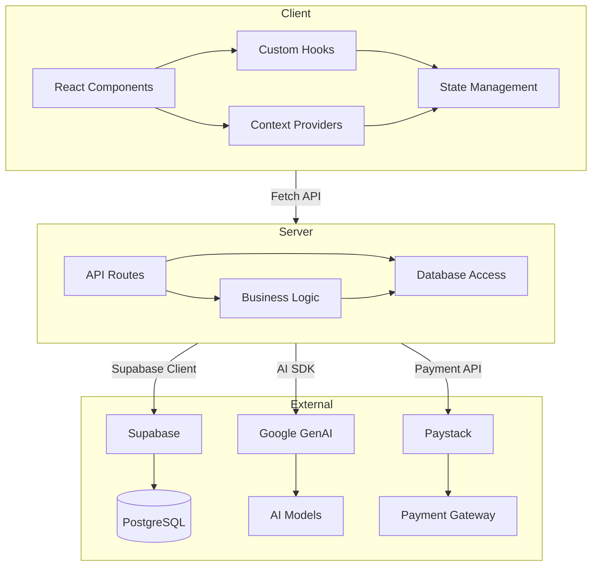
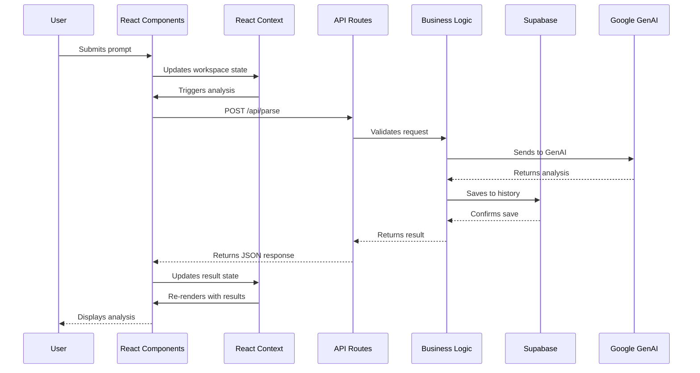
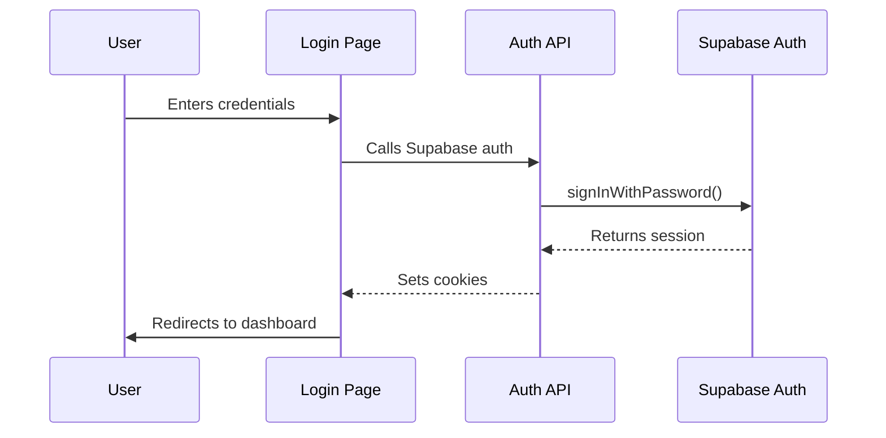
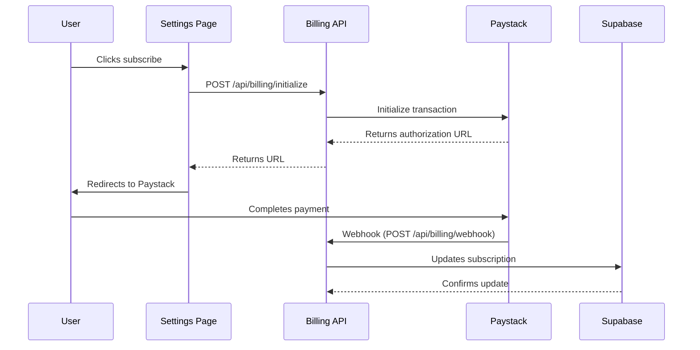

# Architecture Overview

This document provides a comprehensive overview of the Catalyst Workspace Studio architecture, covering the system's high-level design, component structure, data flow, and integration points.

## Table of Contents

- [System Architecture](#system-architecture)
- [Directory Structure](#directory-structure)
- [Core Modules](#core-modules)
- [Data Flow](#data-flow)
- [State Management](#state-management)
- [External Integrations](#external-integrations)
- [Technology Stack](#technology-stack)
- [Design Decisions](#design-decisions)

---

## System Architecture

Catalyst follows a **Modern Next.js Application Architecture** with clear separation of concerns:



### High-Level Layers

```
┌─────────────────────────────────────────────────────────────┐
│                      Presentation Layer                         │
│  ┌─────────────────┐  ┌─────────────────┐  ┌─────────────────┐  │
│  │   Page Components│  │   UI Components │  │   Layout        │  │
│  │   (app/*/page.tsx)│  │   (app/components)│  │   Components    │  │
│  └─────────────────┘  └─────────────────┘  └─────────────────┘  │
├─────────────────────────────────────────────────────────────┤
│                      Application Layer                         │
│  ┌─────────────────┐  ┌─────────────────┐  ┌─────────────────┐  │
│  │   React Context  │  │   Custom Hooks   │  │   State          │  │
│  │   (Auth, Workspace,│  │   (useParsing,  │  │   Management     │  │
│  │    Catalog)       │  │    useWorkspace) │  │                 │  │
│  └─────────────────┘  └─────────────────┘  └─────────────────┘  │
├─────────────────────────────────────────────────────────────┤
│                      API Layer                                │
│  ┌─────────────────┐  ┌─────────────────┐  ┌─────────────────┐  │
│  │   Route Handlers │  │   Request/       │  │   Response       │  │
│  │   (app/api/*/)   │  │   Validation     │  │   Formatting     │  │
│  └─────────────────┘  └─────────────────┘  └─────────────────┘  │
├─────────────────────────────────────────────────────────────┤
│                      Data Layer                               │
│  ┌─────────────────┐  ┌─────────────────┐  ┌─────────────────┐  │
│  │   Supabase       │  │   External APIs  │  │   Libraries      │  │
│  │   Client         │  │   (GenAI,        │  │   (prompts,      │  │
│  │                 │  │    Paystack)     │  │    parsing)      │  │
│  └─────────────────┘  └─────────────────┘  └─────────────────┘  │
└─────────────────────────────────────────────────────────────┘
```

---

## Directory Structure

```
catalyst/
├── app/                          # Next.js App Router
│   ├── (auth)/                   # Auth route group (login, reset-password)
│   ├── api/                      # API route handlers
│   │   ├── analyze/              # Prompt analysis endpoint
│   │   ├── billing/              # Payment processing endpoints
│   │   │   ├── initialize/      # Initialize payment
│   │   │   ├── webhook/         # Paystack webhook handler
│   │   │   └── cancel/          # Cancel subscription
│   │   ├── detect-currency/      # Currency detection
│   │   ├── parse/               # Prompt parsing/optimization
│   │   └── settings/             # User settings endpoints
│   │       ├── api-keys/        # API key management
│   │       ├── billing-portal/  # Billing portal redirect
│   │       ├── delete-account/  # Account deletion
│   │       └── redeem-coupon/   # Coupon redemption
│   │
│   ├── blog/                     # Blog pages
│   ├── components/               # React components
│   │   ├── ClickFeedbackProvider.tsx
│   │   ├── DesktopNav.tsx
│   │   ├── Footer.tsx
│   │   ├── GlassPanel.tsx        # Core design component
│   │   ├── Header.tsx
│   │   ├── history/              # History-related components
│   │   ├── Skeleton.tsx
│   │   └── TokenMeter.tsx
│   │
│   ├── context/                  # React Context providers
│   │   ├── AuthContext.tsx       # Authentication state
│   │   ├── CatalogContext.tsx   # Categories & models catalog
│   │   └── WorkspaceContext.tsx # Workspace state (input, models, etc.)
│   │
│   ├── dashboard/                # User dashboard
│   ├── history/                  # Analysis history
│   ├── hooks/                    # Custom React hooks
│   ├── lib/                      # Business logic & utilities
│   │   ├── apiKeys.ts
│   │   ├── blog.ts
│   │   ├── categories.ts
│   │   ├── engine/               # Analysis engine
│   │   ├── llm/                  # LLM utilities
│   │   ├── models-shared.ts
│   │   ├── models.ts
│   │   ├── paystack.ts           # Paystack integration
│   │   ├── parsing/              # Prompt parsing logic
│   │   ├── promptTokens.ts
│   │   ├── prompts/              # Prompt templates
│   │   ├── prompts-client.ts
│   │   ├── prompts.ts
│   │   ├── supabase-browser.ts   # Browser Supabase client
│   │   ├── supabase-server.ts   # Server Supabase client
│   │   └── supabase.ts
│   │
│   ├── library/                  # Prompt library
│   ├── settings/                 # User settings pages
│   ├── studio/                   # Studio workspace
│   ├── workspace/                # Workspace pages
│   ├── about/                    # About page
│   ├── contact/                  # Contact page
│   ├── privacy/                  # Privacy policy
│   ├── terms/                    # Terms of service
│   ├── favicon.ico
│   ├── globals.css               # Global styles (Glass & Neon design)
│   ├── layout.tsx                # Root layout
│   ├── loading.tsx
│   ├── page.tsx                  # Home page
│   ├── robots.ts
│   └── sitemap.ts
│
├── public/                       # Static assets
├── supabase/                     # Supabase configurations
├── .env                         # Environment variables
├── .env.local
├── .gitignore
├── DESIGN.md                     # Design system documentation
├── next.config.ts
├── package.json
├── pnpm-lock.yaml
├── postcss.config.mjs
├── proxy.ts                     # Development proxy
├── tailwind.config.js           # Tailwind configuration
└── tsconfig.json
```

---

## Core Modules

### 1. Authentication Module

**Location:** `app/(auth)/`, `app/context/AuthContext.tsx`

**Responsibilities:**
- User authentication (login, logout, session management)
- Password reset flow
- Protected route handling
- User profile management

**Key Components:**
- `AuthProvider` - React context for auth state
- `useUser()` - Custom hook for user data
- Login page (`app/(auth)/login/page.tsx`)
- Reset password page (`app/(auth)/reset-password/page.tsx`)

### 2. Workspace Module

**Location:** `app/studio/`, `app/workspace/`, `app/context/WorkspaceContext.tsx`

**Responsibilities:**
- Prompt input and editing
- AI model selection and configuration
- Analysis result display
- Workspace state management

**Key Components:**
- `WorkspaceProvider` - Manages workspace state (input, selected model, controls)
- `useWorkspace()` - Custom hook for workspace data
- Studio page with analysis interface
- Workspace persistence

### 3. Analysis Engine

**Location:** `app/lib/engine/`, `app/api/analyze/`, `app/api/parse/`

**Responsibilities:**
- Prompt analysis and optimization
- AI model communication
- Response parsing and formatting
- Token counting and rate limiting

**Key Components:**
- Engine types and interfaces
- Analysis pipeline
- Prompt optimization logic
- Result formatting

### 4. Billing System

**Location:** `app/lib/paystack.ts`, `app/api/billing/`

**Responsibilities:**
- Subscription management
- Payment processing
- Usage tracking
- Rate limiting

**Key Components:**
- Paystack integration
- Subscription plans
- Usage metering
- Webhook handlers

### 5. Design System

**Location:** `app/components/`, `app/globals.css`, `DESIGN.md`

**Responsibilities:**
- Visual consistency
- Component library
- Theme management (Glass & Neon aesthetic)
- Responsive design

**Key Components:**
- `GlassPanel` - Core design primitive with glassmorphism
- Color tokens and gradients
- Neon glow effects
- Typography system

---

## Data Flow

### User Request Flow



### Authentication Flow



### Billing Flow



---

## State Management

Catalyst uses a **mixed state management approach**:

### React Context (Global State)

| Context | Purpose | Location |
|---------|---------|----------|
| `AuthContext` | User authentication state, profile data | `app/context/AuthContext.tsx` |
| `WorkspaceContext` | Workspace state (input, models, controls, results) | `app/context/WorkspaceContext.tsx` |
| `CatalogContext` | Categories and models catalog | `app/context/CatalogContext.tsx` |
| `ClickFeedbackProvider` | Click feedback animations | `app/components/ClickFeedbackProvider.tsx` |

### Local State (Component-Level)

- React `useState` for component-specific state
- Form state with React Hook Form (if used)
- URL state with Next.js `useSearchParams`

### Data Fetching

- **Server Components**: Direct database access via Supabase server client
- **Client Components**: Fetch API endpoints or use SWR/React Query patterns
- **Caching**: Browser cache, localStorage for guest state

---

## External Integrations

### 1. Supabase Integration

**Purpose:** Database, Authentication, Storage

**Clients:**
- `supabase-browser.ts` - Browser client for client-side operations
- `supabase-server.ts` - Server client for server components and API routes
- `supabase.ts` - Unified export

**Key Features:**
- PostgreSQL database
- Row-level security
- Real-time subscriptions
- Storage for user uploads
- Authentication providers

### 2. Google GenAI Integration

**Purpose:** AI-powered prompt analysis and generation

**Location:** `app/lib/llm/`, called from `app/api/parse/`

**Models Supported:**
- GPT-4 variants
- Claude models
- Llama models
- Midjourney (via prompts)
- DALL-E (via prompts)
- Stable Diffusion (via prompts)

### 3. Paystack Integration

**Purpose:** Payment processing for subscriptions

**Location:** `app/lib/paystack.ts`, `app/api/billing/`

**Features:**
- Transaction initialization
- Webhook handling for payment confirmation
- Subscription management
- Coupon redemption

---

## Technology Stack

### Frontend

| Technology | Version | Purpose |
|------------|---------|---------|
| Next.js | 16.1.6 | React framework with App Router |
| React | 19.2.3 | UI library |
| TypeScript | 5.x | Type safety |
| Tailwind CSS | 4 | Styling |
| @tailwindcss/forms | 0.5.7 | Form styling |
| @tailwindcss/container-queries | 0.1.1 | Responsive containers |
| Lucide React | 0.471.2 | Icons |

### Backend

| Technology | Version | Purpose |
|------------|---------|---------|
| @supabase/supabase-js | 2.99.3 | Supabase client |
| @supabase/ssr | 0.10.0 | Server-side Supabase |
| @google/genai | 1.46.0 | Google GenAI SDK |

### Tooling

| Tool | Purpose |
|------|---------|
| pnpm | Package manager |
| ESLint | Code linting |
| Prettier | Code formatting |
| PostCSS | CSS processing |

---

## Design Decisions

### Why Next.js App Router?

- **Server Components**: Reduce client-side JavaScript, improve performance
- **Simplified Data Fetching**: Direct database access in server components
- **Improved Caching**: Automatic caching and data revalidation
- **Nested Layouts**: Better code organization with layout inheritance
- **Built-in Optimizations**: Image, font, and script optimizations

### Why Supabase?

- **All-in-One**: Database + Auth + Storage in one service
- **Real-time**: Built-in real-time subscriptions
- **PostgreSQL**: Full SQL capabilities with JSON support
- **Row-Level Security**: Fine-grained access control
- **Generous Free Tier**: Cost-effective for development and small projects

### Why Google GenAI?

- **Unified API**: Single SDK for multiple AI models
- **Enterprise-Grade**: Reliable, scalable, well-documented
- **Model Variety**: Access to multiple model providers
- **Streaming Support**: Real-time response streaming

### Why Glass & Neon Design?

- **Modern Aesthetic**: Premium, sophisticated appearance
- **Depth**: Glassmorphism provides visual hierarchy
- **Focus**: Neon accents guide user attention
- **Dark Mode Optimized**: Perfect for developer tools and long sessions
- **Brand Differentiation**: Unique visual identity

---

## Architecture Principles

1. **Separation of Concerns**: Clear boundaries between UI, business logic, and data access
2. **Progressive Enhancement**: Core functionality works without JavaScript
3. **Type Safety**: TypeScript throughout the application
4. **Performance First**: Optimize for fast page loads and smooth interactions
5. **Developer Experience**: Clean, maintainable, well-documented code
6. **User Experience**: Intuitive, responsive, accessible interfaces

---

## See Also

- [Technology Stack Details](technology-stack.md)
- [Data Flow Diagrams](data-flow.md)
- [Module Dependencies](module-map.md)
- [DESIGN.md](/DESIGN.md) - Visual design system
- [Getting Started](../getting-started/index.md) - Setup instructions
