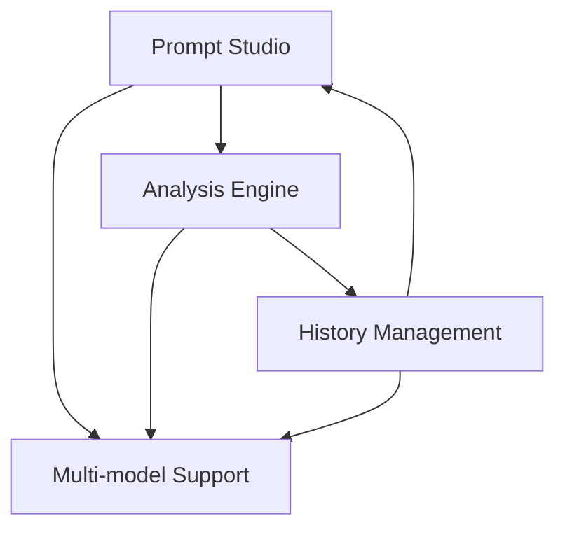

# Features Overview

Catalyst provides a comprehensive suite of AI-powered features designed to help users create, optimize, and manage high-quality prompts for various use cases.

## Core Features

### 🎨 [Prompt Studio](./studio.md)
The central workspace where users can craft, refine, and optimize their prompts with real-time AI-powered analysis and suggestions.

**Key Capabilities:**
- Real-time prompt analysis and optimization
- Multi-model support (Claude, GPT-4, Gemini, Llama, etc.)
- Intent detection and classification
- Domain-specific optimizations
- Live preview of optimized prompts

### 🔍 [Analysis Engine](./analysis.md)
Advanced AI-powered analysis system that deconstructs and understands user prompts to provide intelligent optimizations.

**Key Capabilities:**
- Natural language understanding
- Intent and domain detection
- Multi-modal input support (text, image, video, audio, code, geospatial)
- Context-aware optimizations
- Model-specific prompt formatting

### 📚 [History Management](./history.md)
Complete prompt history tracking with advanced filtering, search, and management capabilities.

**Key Capabilities:**
- Search and filter saved prompts
- Organize by tags, models, and categories
- Favorite and quick-access functionality
- Pagination and batch operations
- Usage statistics and analytics

### 🏛️ [Prompt Library](./library.md)
Curated and community prompt repository to discover, search, and import battle-tested prompt architectures directly into the Studio.

### 💳 [Subscriptions & Token Economics](./pricing-subscriptions.md)
Transparent multi-tier pricing plans (Spark, Orbit, Nova, Pulsar, Infinity) with weekly token allowances, automated Paystack billing, and workspace scaling.

## Feature Integration

All Catalyst features work seamlessly together:

## Quick Start

1. **Create a prompt** in the [Prompt Studio](./studio.md)
2. **Analyze and optimize** using the [Analysis Engine](./analysis.md)
3. **Save and manage** your prompts in [History](./history.md)

## See Also

- [API Reference](../api/index.md) - Technical API documentation
- [Components](../components/index.md) - UI component library
- [Design System](../components/design-system.md) - Visual design tokens
- [Getting Started](../getting-started/index.md) - Setup and configuration