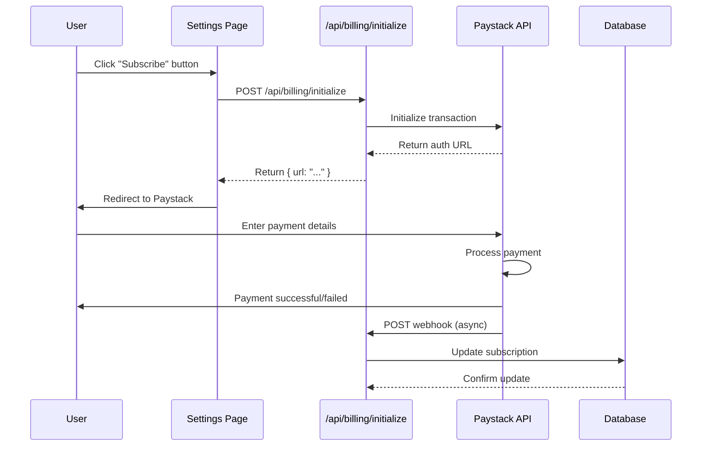

# Paystack Integration

This document provides comprehensive documentation for the Paystack integration in Catalyst Workspace Studio, covering payment processing, subscription management, and webhook handling.

## Table of Contents

- [Overview](#overview)
- [Setup](#setup)
- [Payment Flow](#payment-flow)
- [Subscription Management](#subscription-management)
- [Webhook Handling](#webhook-handling)
- [API Reference](#api-reference)
- [Error Handling](#error-handling)
- [Best Practices](#best-practices)
- [Troubleshooting](#troubleshooting)

---

## Overview

**Paystack** is the primary payment processor for Catalyst, providing:

| Feature | Purpose | Implementation |
|---------|---------|----------------|
| **Payment Processing** | Handle credit/debit card payments | `app/lib/paystack.ts` |
| **Subscription Management** | Recurring billing | `app/api/billing/*` |
| **Webhook Handling** | Asynchronous event processing | `app/api/billing/webhook` |
| **Coupon Management** | Discount codes | `app/api/settings/redeem-coupon` |
| **Billing Portal** | User subscription management | `app/api/settings/billing-portal` |

**Architecture:**

```
┌─────────────────────────────────────────────────────────────┐
│                      Next.js Application                      │
├─────────────────────────────────────────────────────────────┤
│  ┌─────────────────────────────────────────────────────────┐  │
│  │                    API Layer                               │  │
│  │  ┌─────────────────────────────────────────────────────┐  │  │
│  │  │              app/api/billing/                        │  │  │
│  │  │  ┌──────────┐  ┌──────────┐  ┌──────────┐              │  │  │
│  │  │  │ initialize│  │ webhook │  │ cancel   │              │  │  │
│  │  │  └──────────┘  └──────────┘  └──────────┘              │  │  │
│  │  │                                                      │  │  │
│  │  └──────────────────────────────────────────────────────┘  │  │
│  │                                                      │  │  │
│  └──────────────────────────────────────┬─────────────────────┘  │  │
│                                          │                        │
│  ┌───────────────────────────────────────▼───────────────────┐  │  │
│  │                    lib/paystack.ts                        │  │  │
│  │  Paystack service layer with helper functions             │  │  │
│  └───────────────────────────────────────────────────────────┘  │
└──────────────────────────────────────────────────────────────┘
                              │
                              ▼
┌─────────────────────────────────────────────────────────────┐
│                      Paystack API                            │
├─────────────────────────────────────────────────────────────┤
│  Endpoint: https://api.paystack.co                          │
│  Features: Transactions, Subscriptions, Customers, Plans     │
└─────────────────────────────────────────────────────────────┘
```

---

## Setup

### 1. Get API Keys

1. Go to [Paystack Dashboard](https://dashboard.paystack.com/)
2. Sign up for an account (if you don't have one)
3. Go to **Settings > API Keys & Webhooks**
4. Copy your keys:
   - **Test Secret Key**: For development (starts with `sk_test_`)
   - **Test Public Key**: For development (starts with `pk_test_`)
   - **Live Secret Key**: For production (starts with `sk_live_`)
   - **Live Public Key**: For production (starts with `pk_live_`)

### 2. Configure Environment

Add to your `.env.local`:

```bash
# Paystack Configuration
PAYSTACK_SECRET_KEY=sk_test_xxxxxxxxx
PAYSTACK_PUBLIC_KEY=pk_test_xxxxxxxxx
NEXT_PUBLIC_PAYSTACK_PUBLIC_KEY=pk_test_xxxxxxxxx

# Subscription Plan IDs (from Paystack)
NEXT_PUBLIC_PAYSTACK_PLAN_BASIC=PLN_xxxxx
NEXT_PUBLIC_PAYSTACK_PLAN_PLUS=PLN_xxxxx
NEXT_PUBLIC_PAYSTACK_PLAN_PRO=PLN_xxxxx
NEXT_PUBLIC_PAYSTACK_PLAN_ULTRA=PLN_xxxxx
```

### 3. Install Dependencies

No special dependencies needed - Paystack uses standard HTTP requests.

---

## Payment Flow

### Transaction Flow



### Implementation

#### Step 1: Initialize Transaction

```typescript
// app/api/billing/initialize/route.ts
import { createClient } from "../../../lib/supabase-server";
import { NextResponse } from "next/server";
import { initializeTransaction } from "../../../lib/paystack";

export async function POST(request: Request) {
  const supabase = await createClient();
  
  try {
    // Get authenticated user
    const { data: { user } } = await supabase.auth.getUser();
    
    if (!user) {
      return NextResponse.json({ message: "Unauthorized" }, { status: 401 });
    }

    // Get request body
    const { tier, currency, amount, baseAmount } = await request.json();

    // Validate tier
    const plans: Record<string, string | null | undefined> = {
      "free": null,
      "basic": process.env.NEXT_PUBLIC_PAYSTACK_PLAN_BASIC,
      "plus": process.env.NEXT_PUBLIC_PAYSTACK_PLAN_PLUS,
      "pro": process.env.NEXT_PUBLIC_PAYSTACK_PLAN_PRO,
      "ultra": process.env.NEXT_PUBLIC_PAYSTACK_PLAN_ULTRA,
    };

    if (!tier || !(tier in plans)) {
      return NextResponse.json(
        { message: "Invalid subscription tier" },
        { status: 400 }
      );
    }

    // Build metadata
    const metadata = JSON.stringify({
      tier: tier,
      userEmail: user.email,
      billingCurrency: currency,
      baseAmount: baseAmount,
    });

    // Build callback URL
    const origin = request.headers.get("origin") || "http://localhost:3000";
    const callbackUrl = `${origin}/settings/subscriptions?session=success`;

    // Initialize Paystack transaction
    const paystackSession = await initializeTransaction(
      user.email!,
      currency,
      amount,
      callbackUrl,
      metadata,
      plans[tier],
    );

    if (!paystackSession.status) {
      return NextResponse.json(
        { message: "Failed to initialize checkout." },
        { status: 400 }
      );
    }

    return NextResponse.json({ url: paystackSession.data.authorization_url });
    
  } catch (err: any) {
    console.error("Initialize transaction error:", err);
    return NextResponse.json(
      { message: err.message || "Internal server error" },
      { status: 500 }
    );
  }
}
```

#### Step 2: Paystack Service

```typescript
// app/lib/paystack.ts
export interface PaystackResponse {
  status: boolean;
  message: string;
  data: any;
}

/**
 * Initialize a Paystack transaction
 * 
 * @param email - Customer email
 * @param currency - Currency code (e.g., "USD", "NGN")
 * @param amount - Amount in smallest currency unit (e.g., cents, kobo)
 * @param callbackUrl - URL to redirect to after payment
 * @param metadata - Additional metadata (will be passed to webhook)
 * @param plan - Optional plan code for subscription
 * @returns Promise with authorization URL or error
 */
export async function initializeTransaction(
  email: string,
  currency: string,
  amount: number,
  callbackUrl: string,
  metadata?: string,
  plan?: string,
): Promise<PaystackResponse> {
  const secretKey = process.env.PAYSTACK_SECRET_KEY;
  
  if (!secretKey) {
    throw new Error("PAYSTACK_SECRET_KEY is not configured");
  }

  const requestBody: Record<string, any> = {
    email,
    amount,
    currency,
    callback_url: callbackUrl,
    metadata: metadata || {},
  };

  // For subscriptions, include plan
  if (plan) {
    requestBody.plan = plan;
  }

  try {
    const response = await fetch("https://api.paystack.co/transaction/initialize", {
      method: "POST",
      headers: {
        "Authorization": `Bearer ${secretKey}`,
        "Content-Type": "application/json",
      },
      body: JSON.stringify(requestBody),
    });

    const result: PaystackResponse = await response.json();
    
    if (!result.status) {
      throw new Error(result.message || "Failed to initialize transaction");
    }

    return result;
    
  } catch (error: any) {
    console.error("Paystack initialization error:", error);
    return {
      status: false,
      message: error.message || "Failed to initialize transaction",
      data: null,
    };
  }
}

/**
 * Verify a Paystack transaction
 */
export async function verifyTransaction(reference: string): Promise<PaystackResponse> {
  const secretKey = process.env.PAYSTACK_SECRET_KEY;
  
  if (!secretKey) {
    throw new Error("PAYSTACK_SECRET_KEY is not configured");
  }

  try {
    const response = await fetch(`https://api.paystack.co/transaction/verify/${reference}`, {
      headers: {
        "Authorization": `Bearer ${secretKey}`,
        "Content-Type": "application/json",
      },
    });

    return await response.json();
    
  } catch (error: any) {
    console.error("Paystack verification error:", error);
    return {
      status: false,
      message: error.message || "Failed to verify transaction",
      data: null,
    };
  }
}

/**
 * Create a subscription
 */
export async function createSubscription(
  customer: string,
  plan: string,
): Promise<PaystackResponse> {
  const secretKey = process.env.PAYSTACK_SECRET_KEY;
  
  if (!secretKey) {
    throw new Error("PAYSTACK_SECRET_KEY is not configured");
  }

  try {
    const response = await fetch("https://api.paystack.co/subscription", {
      method: "POST",
      headers: {
        "Authorization": `Bearer ${secretKey}`,
        "Content-Type": "application/json",
      },
      body: JSON.stringify({ customer, plan }),
    });

    return await response.json();
    
  } catch (error: any) {
    console.error("Paystack subscription error:", error);
    return {
      status: false,
      message: error.message || "Failed to create subscription",
      data: null,
    };
  }
}

/**
 * Get billing portal URL
 */
export async function getBillingPortalUrl(
  customer: string,
  returnUrl?: string,
): Promise<PaystackResponse> {
  const secretKey = process.env.PAYSTACK_SECRET_KEY;
  
  if (!secretKey) {
    throw new Error("PAYSTACK_SECRET_KEY is not configured");
  }

  const requestBody: Record<string, any> = { customer };
  if (returnUrl) {
    requestBody.return_url = returnUrl;
  }

  try {
    const response = await fetch("https://api.paystack.co/page", {
      method: "POST",
      headers: {
        "Authorization": `Bearer ${secretKey}`,
        "Content-Type": "application/json",
      },
      body: JSON.stringify(requestBody),
    });

    return await response.json();
    
  } catch (error: any) {
    console.error("Paystack portal error:", error);
    return {
      status: false,
      message: error.message || "Failed to get billing portal URL",
      data: null,
    };
  }
}
```

---

## Subscription Management

### Subscription Status

Catalyst tracks subscription status in the `subscriptions` table:

```typescript
// app/lib/subscriptions.ts
export interface Subscription {
  id: string;
  user_id: string;
  plan_id: string;
  status: "active" | "inactive" | "cancelled" | "pending";
  paystack_subscription_id: string | null;
  current_period_end: string | null;
  cancel_at_period_end: boolean;
  created_at: string;
  updated_at: string;
}

/**
 * Get user's active subscription
 */
export async function getActiveSubscription(userId: string): Promise<Subscription | null> {
  const supabase = await createClient();
  
  const { data, error } = await supabase
    .from("subscriptions")
    .select("*")
    .eq("user_id", userId)
    .eq("status", "active")
    .single();

  if (error || !data) {
    return null;
  }

  return data;
}

/**
 * Create or update subscription
 */
export async function upsertSubscription(
  userId: string,
  planId: string,
  paystackSubscriptionId: string,
  currentPeriodEnd: string,
): Promise<Subscription> {
  const supabase = await createClient();
  
  const { data, error } = await supabase
    .from("subscriptions")
    .upsert({
      user_id: userId,
      plan_id: planId,
      status: "active",
      paystack_subscription_id: paystackSubscriptionId,
      current_period_end: currentPeriodEnd,
      cancel_at_period_end: false,
    })
    .select()
    .single();

  if (error || !data) {
    throw new Error(error?.message || "Failed to create subscription");
  }

  return data;
}

/**
 * Cancel subscription
 */
export async function cancelSubscription(
  subscriptionId: string,
): Promise<boolean> {
  const supabase = await createClient();
  
  const { error } = await supabase
    .from("subscriptions")
    .update({
      status: "cancelled",
      cancel_at_period_end: true,
    })
    .eq("id", subscriptionId);

  if (error) {
    console.error("Cancel subscription error:", error);
    return false;
  }

  return true;
}
```

---

## Webhook Handling

### Webhook Configuration

1. In Paystack Dashboard, go to **Settings > API Keys & Webhooks**
2. Click **Add Webhook URL**
3. Enter your webhook URL: `https://your-domain.com/api/billing/webhook`
4. Select events to listen to:
   - `charge.success`
   - `subscription.create`
   - `subscription.update`
   - `invoice.create`
   - `invoice.payment_succeeded`

### Webhook Handler

```typescript
// app/api/billing/webhook/route.ts
import { NextResponse } from "next/server";
import { createClient } from "../../../lib/supabase-server";
import crypto from "crypto";

export async function POST(request: Request) {
  const supabase = await createClient();
  const secretKey = process.env.PAYSTACK_SECRET_KEY!;
  
  try {
    // Get raw body
    const body = await request.text();
    const signature = request.headers.get("x-paystack-signature");

    // Verify signature
    if (!signature) {
      return NextResponse.json(
        { status: false, message: "No signature" },
        { status: 400 }
      );
    }

    // Hash the body with secret key
    const hash = crypto
      .createHmac("sha512", secretKey)
      .update(body)
      .digest("hex");

    if (hash !== signature) {
      return NextResponse.json(
        { status: false, message: "Invalid signature" },
        { status: 401 }
      );
    }

    // Parse body
    const payload = JSON.parse(body);
    const event = payload.event;
    const data = payload.data;

    // Handle different events
    switch (event) {
      case "charge.success":
        return await handleChargeSuccess(data, supabase);

      case "subscription.create":
        return await handleSubscriptionCreate(data, supabase);

      case "subscription.update":
        return await handleSubscriptionUpdate(data, supabase);

      case "invoice.create":
        return await handleInvoiceCreate(data, supabase);

      case "invoice.payment_succeeded":
        return await handleInvoicePaymentSucceeded(data, supabase);

      default:
        console.log("Unhandled event:", event);
        return NextResponse.json(
          { status: true, message: "Event not handled" }
        );
    }
    
  } catch (error: any) {
    console.error("Webhook error:", error);
    return NextResponse.json(
      { status: false, message: error.message || "Webhook processing failed" },
      { status: 500 }
    );
  }
}

// Event handlers
async function handleChargeSuccess(data: any, supabase: any) {
  const { reference, customer, metadata } = data;
  
  // Verify transaction
  const verification = await verifyTransaction(reference);
  if (!verification.status || verification.data.status !== "success") {
    console.error("Transaction verification failed:", reference);
    return NextResponse.json({ status: false, message: "Verification failed" });
  }

  // Get user by email
  const { data: user } = await supabase.auth.admin.getUserByEmail(customer.email);
  if (!user) {
    console.error("User not found for email:", customer.email);
    return NextResponse.json({ status: false, message: "User not found" });
  }

  // Parse metadata
  let tier: string | null = null;
  try {
    const meta = JSON.parse(metadata);
    tier = meta.tier;
  } catch (e) {
    console.warn("Failed to parse metadata:", metadata);
  }

  // Create or update subscription
  if (tier) {
    await upsertSubscription(
      user.id,
      tier,
      verification.data.reference,
      data.paid_at
    );
  }

  return NextResponse.json({ status: true, message: "Charge processed" });
}

async function handleSubscriptionCreate(data: any, supabase: any) {
  console.log("Subscription created:", data);
  
  // Update subscription in database
  const { customer, plan, subscription_code, created_at } = data;
  
  const { data: user } = await supabase.auth.admin.getUserByEmail(customer.email);
  if (!user) {
    console.error("User not found for subscription:", subscription_code);
    return NextResponse.json({ status: false, message: "User not found" });
  }

  await upsertSubscription(
    user.id,
    plan.plan_code,
    subscription_code,
    created_at
  );

  return NextResponse.json({ status: true, message: "Subscription created" });
}

async function handleSubscriptionUpdate(data: any, supabase: any) {
  console.log("Subscription updated:", data);
  
  // Update subscription status
  const { customer, subscription_code, status } = data;
  
  const { error } = await supabase
    .from("subscriptions")
    .update({ status })
    .eq("paystack_subscription_id", subscription_code);

  if (error) {
    console.error("Failed to update subscription:", error);
  }

  return NextResponse.json({ status: true, message: "Subscription updated" });
}

async function handleInvoiceCreate(data: any, supabase: any) {
  console.log("Invoice created:", data);
  // Handle invoice creation (e.g., send notification)
  return NextResponse.json({ status: true, message: "Invoice processed" });
}

async function handleInvoicePaymentSucceeded(data: any, supabase: any) {
  console.log("Invoice payment succeeded:", data);
  // Handle successful invoice payment
  return NextResponse.json({ status: true, message: "Invoice payment processed" });
}
```

---

## API Reference

### Paystack API Endpoints

| Endpoint | Method | Description |
|----------|--------|-------------|
| `/transaction/initialize` | POST | Initialize a transaction |
| `/transaction/verify/:reference` | GET | Verify a transaction |
| `/transaction` | GET | List transactions |
| `/subscription` | POST | Create a subscription |
| `/subscription/:id` | GET | Get a subscription |
| `/subscription/:id` | PUT | Update a subscription |
| `/customer` | POST | Create a customer |
| `/customer/:id` | GET | Get a customer |
| `/plan` | POST | Create a plan |
| `/plan` | GET | List plans |

### Request Headers

All Paystack API requests require:

```http
Authorization: Bearer YOUR_SECRET_KEY
Content-Type: application/json
```

### Response Format

All Paystack API responses follow this format:

```json
{
  "status": true/false,
  "message": "Success/error message",
  "data": { ... }
}
```

---

## Error Handling

### Common Paystack Errors

| Error Code | HTTP Status | Description | Solution |
|------------|-------------|-------------|----------|
| `invalid_key` | 401 | Invalid API key | Verify your secret key |
| `invalid_transaction` | 404 | Transaction not found | Check the transaction reference |
| `insufficient_funds` | 400 | Insufficient funds | User needs to use a different card |
| `card_declined` | 400 | Card declined | User needs to contact bank |
| `rate_limit_exceeded` | 429 | Too many requests | Implement retry with backoff |

### Error Handling Code

```typescript
// Handle Paystack API errors
function handlePaystackError(error: any, context: string): never {
  if (error.message.includes("invalid_key")) {
    throw new Error("Invalid Paystack API key");
  }
  
  if (error.message.includes("invalid_transaction")) {
    throw new Error("Transaction not found");
  }
  
  if (error.message.includes("insufficient_funds")) {
    throw new Error("Insufficient funds on card");
  }
  
  if (error.message.includes("card_declined")) {
    throw new Error("Card was declined by bank");
  }
  
  if (error.status === 429) {
    throw new Error("Rate limit exceeded, please try again later");
  }
  
  console.error(`Paystack error in ${context}:`, error);
  throw new Error("Payment processing error: " + error.message);
}
```

---

## Best Practices

### 1. Idempotency

Always use idempotency keys for transactions to prevent duplicate charges:

```typescript
// Generate idempotency key
function generateIdempotencyKey(): string {
  return `catalyst_${Date.now()}_${Math.random().toString(36).substr(2, 9)}`;
}

// Use in transaction initialization
const idempotencyKey = generateIdempotencyKey();

const response = await fetch("https://api.paystack.co/transaction/initialize", {
  method: "POST",
  headers: {
    "Authorization": `Bearer ${secretKey}`,
    "Content-Type": "application/json",
    "Idempotency-Key": idempotencyKey,
  },
  body: JSON.stringify(requestBody),
});
```

### 2. Amount Calculation

Always calculate amounts in the **smallest currency unit** (e.g., kobo for NGN, cents for USD):

```typescript
// Convert USD to cents
function usdToCents(amount: number): number {
  return Math.round(amount * 100);
}

// Convert NGN to kobo
function ngnToKobo(amount: number): number {
  return Math.round(amount * 100);
}

// Format for Paystack
const amountInKobo = ngnToKobo(1000); // 1000 NGN = 100000 kobo
```

### 3. Metadata Usage

Use metadata to pass additional information that will be returned in webhooks:

```typescript
const metadata = {
  userId: user.id,
  userEmail: user.email,
  plan: selectedPlan,
  tier: subscriptionTier,
  customData: { ... },
};

// This will be available in webhook payload
const requestBody = {
  email: user.email,
  amount: amountInKobo,
  currency: "NGN",
  metadata: JSON.stringify(metadata),
  // ...
};
```

### 4. Webhook Security

Always verify webhook signatures:

```typescript
function verifyWebhookSignature(
  body: string,
  signature: string,
  secretKey: string,
): boolean {
  const hash = crypto
    .createHmac("sha512", secretKey)
    .update(body)
    .digest("hex");
  
  return crypto.timingSafeEqual(
    Buffer.from(hash),
    Buffer.from(signature)
  );
}
```

---

## Troubleshooting

### Common Issues

#### 1. Webhook Not Firing

**Symptoms:** Payments succeed but subscription not activated

**Solutions:**
- Verify webhook URL is correct in Paystack dashboard
- Check webhook URL is accessible from the internet
- Verify HTTPS is used (Paystack requires HTTPS for production)
- Check firewall/security group settings
- Test with [ngrok](https://ngrok.com/) for local development

#### 2. Signature Verification Failing

**Symptoms:** Webhook returns "Invalid signature"

**Solutions:**
- Verify the secret key matches
- Ensure you're using the raw request body (not parsed JSON)
- Check the signature algorithm (Paystack uses HMAC-SHA512)
- Verify the secret key is for the correct environment (test vs live)

#### 3. Transactions Not Completing

**Symptoms:** User is redirected to Paystack but payment doesn't complete

**Solutions:**
- Verify callback URL is correct
- Check for errors in the Paystack dashboard
- Verify the customer email is valid
- Check for card issues (insufficient funds, expired card, etc.)

#### 4. Subscriptions Not Syncing

**Symptoms:** Subscription status in Paystack doesn't match database

**Solutions:**
- Check webhook handler logs
- Verify webhook is processing successfully
- Manually sync subscriptions using Paystack API
- Check for errors in subscription update logic

### Testing Tools

**Local Webhook Testing with ngrok:**

```bash
# Install ngrok
npm install -g ngrok

# Start ngrok tunnel
ngrok http 3000

# Update Paystack webhook URL to ngrok URL
# e.g., https://abc123.ngrok.io/api/billing/webhook

# Test with Paystack dashboard's "Send test webhook"
```

**Manual Webhook Testing:**

```bash
# Send test webhook using curl
curl -X POST http://localhost:3000/api/billing/webhook \
  -H "Content-Type: application/json" \
  -H "x-paystack-signature: YOUR_SIGNATURE" \
  -d '{
    "event": "charge.success",
    "data": {
      "id": 12345,
      "reference": "test_ref_12345",
      "status": "success",
      "customer": {
        "email": "test@example.com"
      },
      "metadata": {
        "tier": "plus"
      }
    }
  }'
```

---

## See Also

- [Integrations Overview](./index.md)
- [Supabase Integration](supabase.md)
- [Google GenAI Integration](google-genai.md)
- [Billing API Reference](../api/index.md#billing-endpoints)
- [Paystack Documentation](https://paystack.com/docs)
