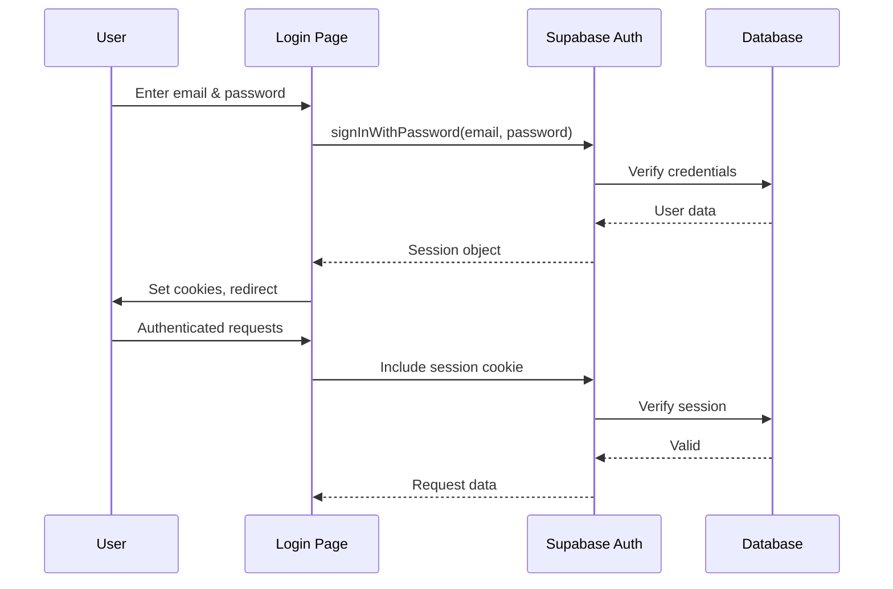

# Supabase Integration

This document provides comprehensive documentation for the Supabase integration in Catalyst Workspace Studio, covering database access, authentication, real-time subscriptions, and storage.

## Table of Contents

- [Overview](#overview)
- [Client Setup](#client-setup)
- [Authentication](#authentication)
- [Database Access](#database-access)
- [Real-time Subscriptions](#real-time-subscriptions)
- [Storage](#storage)
- [Row-Level Security (RLS)](#row-level-security-rls)
- [Server Functions](#server-functions)
- [Best Practices](#best-practices)
- [Troubleshooting](#troubleshooting)
- [API Reference](#api-reference)

---

## Overview

**Supabase** is the primary backend service for Catalyst, providing:

| Feature | Purpose | Usage |
|---------|---------|-------|
| **PostgreSQL Database** | Data storage | User profiles, analysis history, API keys, subscriptions |
| **Authentication** | User management | Email/password, OAuth providers, JWT tokens |
| **Realtime** | Live updates | Collaborative features, live data |
| **Storage** | File hosting | User uploads, avatars, generated content |
| **Edge Functions** | Serverless compute | Custom backend logic |

**Architecture:**

```
┌─────────────────────────────────────────────────────────────┐
│                      Next.js Application                      │
├─────────────────────────────────────────────────────────────┤
│  ┌─────────────────────────────────────────────────────────┐  │
│  │                      app/                               │  │
│  │  ┌─────────────┐  ┌─────────────┐  ┌─────────────────┐  │  │
│  │  │ Server      │  │ Client      │  │ API Routes      │  │  │
│  │  │ Components  │  │ Components  │  │                 │  │  │
│  │  └──────┬──────┘  └──────┬──────┘  └────────┬────────┘  │  │
│  └─────────┼─────────────────┼──────────────────┼──────────┘  │
└────────────┼─────────────────┼──────────────────┼──────────┘
              │                 │                  │
              ▼                 ▼                  ▼
┌─────────────────────┐ ┌─────────────┐ ┌─────────────┐
│ supabase-server.ts   │ │ supabase-  │ │ Route       │
│ (Server Client)     │ │ browser.ts │ │ Handlers    │
│                     │ │ (Browser)   │ │             │
└─────────────┬───────┘ └───────┬─────┘ └──────┬──────┘
              │                 │                │
              └─────────────────┼────────────────┘
                                │
                                ▼
              ┌─────────────────────────────────┐
              │        Supabase Services         │
              │  ┌─────────┐  ┌─────────┐      │
              │  │  Auth   │  │  DB     │      │
              │  └─────────┘  └─────────┘      │
              │  ┌─────────┐  ┌─────────┐      │
              │  │ Realtime│  │ Storage │      │
              │  └─────────┘  └─────────┘      │
              └─────────────────────────────────┘
```

---

## Client Setup

Catalyst uses **two Supabase clients** for different contexts:

### 1. Server Client (`supabase-server.ts`)

**Purpose:** Database access and server-side operations

**Location:** `app/lib/supabase-server.ts`

**Usage:** 
- Server Components
- API Routes
- Server Actions
- Any code that runs on the server

```typescript
// app/lib/supabase-server.ts
import { createServerClient, type CookieOptions } from "@supabase/ssr";
import { cookies } from "next/headers";

export async function createClient() {
  const cookieStore = await cookies();

  return createServerClient(
    process.env.NEXT_PUBLIC_SUPABASE_URL!,
    process.env.NEXT_PUBLIC_SUPABASE_PUBLISHABLE_DEFAULT_KEY!,
    {
      cookies: {
        getAll() {
          return cookieStore.getAll();
        },
        setAll(cookiesToSet: { name: string; value: string; options: CookieOptions }[]) {
          try {
            cookiesToSet.forEach(({ name, value, options }) =>
              cookieStore.set(name, value, options)
            );
          } catch {
            // The `set` method might throw if the cookie is malformed
          }
        },
      },
    }
  );
}

export function createPublicClient() {
  return createSupabaseClient(
    process.env.NEXT_PUBLIC_SUPABASE_URL!,
    process.env.NEXT_PUBLIC_SUPABASE_PUBLISHABLE_DEFAULT_KEY!
  );
}

export async function getServerUser() {
  const supabase = await createClient();
  try {
    const { data: { user } } = await supabase.auth.getUser();
    return user;
  } catch (error) {
    console.error("Error retrieving user from server:", error);
    return null;
  }
}
```

**Usage Example:**

```typescript
// In a Server Component
import { createClient } from "@/lib/supabase-server";

export async function UserProfile({ userId }: { userId: string }) {
  const supabase = await createClient();
  const { data: profile } = await supabase
    .from("profiles")
    .select("*")
    .eq("id", userId)
    .single();

  return <div>{profile?.username}</div>;
}
```

### 2. Browser Client (`supabase-browser.ts`)

**Purpose:** Client-side operations (real-time, auth state changes)

**Location:** `app/lib/supabase-browser.ts`

**Usage:**
- Client Components
- React hooks
- Browser-side interactivity

```typescript
// app/lib/supabase-browser.ts
import { createBrowserClient } from "@supabase/ssr";

export const supabase = createBrowserClient(
  process.env.NEXT_PUBLIC_SUPABASE_URL!,
  process.env.NEXT_PUBLIC_SUPABASE_PUBLISHABLE_DEFAULT_KEY!
);
```

**Usage Example:**

```typescript
"use client";

import { supabase } from "@/lib/supabase-browser";
import { useEffect, useState } from "react";

export function AuthListener() {
  const [user, setUser] = useState<any>(null);

  useEffect(() => {
    // Listen for auth state changes
    const { data: { subscription } } = supabase.auth.onAuthStateChange(
      (event, session) => {
        setUser(session?.user ?? null);
      }
    );

    // Get initial session
    supabase.auth.getSession().then(({ data: { session } }) => {
      setUser(session?.user ?? null);
    });

    return () => subscription.unsubscribe();
  }, []);

  return <div>{user?.email}</div>;
}
```

### 3. Unified Export (`supabase.ts`)

**Purpose:** Simplified import for common use cases

**Location:** `app/lib/supabase.ts`

```typescript
// app/lib/supabase.ts
import { supabase as supabaseBrowser } from "./supabase-browser";

export const supabase = supabaseBrowser;
```

---

## Authentication

Supabase provides **JWT-based authentication** with multiple methods.

### Available Methods

| Method | Description | Status |
|--------|-------------|--------|
| Email/Password | Traditional email authentication | ✅ Implemented |
| Phone | SMS-based authentication | ❌ Not used |
| OAuth (Google, GitHub, etc.) | Third-party provider auth | ⚠️ Optional |
| Magic Link | Passwordless email auth | ❌ Not used |
| Anonymous | Temporary guest sessions | ❌ Not used |

### Authentication Flow



### Implementation

#### Sign Up

```typescript
// app/(auth)/signup/actions.ts
"use server";

import { createClient } from "@/lib/supabase-server";

export async function signup(formData: FormData) {
  const supabase = await createClient();
  
  const email = formData.get("email") as string;
  const password = formData.get("password") as string;
  const username = formData.get("username") as string;

  // Validate input
  if (!email || !password) {
    throw new Error("Email and password are required");
  }

  // Create user
  const { data, error } = await supabase.auth.signUp({
    email,
    password,
    options: {
      data: {
        username,
      },
    },
  });

  if (error) {
    throw new Error(error.message);
  }

  // Create profile
  const { error: profileError } = await supabase
    .from("profiles")
    .insert({
      id: data.user.id,
      email,
      username,
    });

  if (profileError) {
    // Clean up user if profile creation fails
    await supabase.auth.admin.deleteUser(data.user.id);
    throw new Error(profileError.message);
  }

  return { success: true, user: data.user };
}
```

#### Sign In

```typescript
// app/(auth)/login/actions.ts
"use server";

import { createClient } from "@/lib/supabase-server";
import { redirect } from "next/navigation";

export async function login(formData: FormData) {
  const supabase = await createClient();
  
  const email = formData.get("email") as string;
  const password = formData.get("password") as string;

  const { data, error } = await supabase.auth.signInWithPassword({
    email,
    password,
  });

  if (error) {
    return { error: error.message };
  }

  // Redirect to dashboard or previous page
  redirect("/dashboard");
}
```

#### Sign Out

```typescript
// app/(auth)/logout/actions.ts
"use server";

import { createClient } from "@/lib/supabase-server";
import { redirect } from "next/navigation";

export async function logout() {
  const supabase = await createClient();
  
  await supabase.auth.signOut();
  
  redirect("/login");
}
```

#### Session Management

```typescript
// app/context/AuthContext.tsx
"use client";

import { createContext, useContext, useEffect, useState } from "react";
import { supabase } from "@/lib/supabase-browser";
import { useRouter } from "next/navigation";

interface AuthContextType {
  user: any | null;
  isLoading: boolean;
  error: Error | null;
  signIn: (email: string, password: string) => Promise<void>;
  signOut: () => Promise<void>;
}

const AuthContext = createContext<AuthContextType | undefined>(undefined);

export function AuthProvider({ children }: { children: React.ReactNode }) {
  const [user, setUser] = useState<any | null>(null);
  const [isLoading, setIsLoading] = useState(true);
  const [error, setError] = useState<Error | null>(null);
  const router = useRouter();

  useEffect(() => {
    const { data: { subscription } } = supabase.auth.onAuthStateChange(
      async (event, session) => {
        setUser(session?.user ?? null);
        setIsLoading(false);
        
        // Sync profile on auth state change
        if (session?.user) {
          await syncProfile(session.user);
        }
      }
    );

    // Get initial session
    supabase.auth.getSession().then(({ data: { session } }) => {
      setUser(session?.user ?? null);
      setIsLoading(false);
    });

    return () => subscription.unsubscribe();
  }, []);

  const signIn = async (email: string, password: string) => {
    try {
      setIsLoading(true);
      const { data, error } = await supabase.auth.signInWithPassword({
        email,
        password,
      });

      if (error) {
        throw new Error(error.message);
      }

      setUser(data.user);
      router.push("/dashboard");
    } catch (err) {
      setError(err as Error);
      throw err;
    } finally {
      setIsLoading(false);
    }
  };

  const signOut = async () => {
    try {
      await supabase.auth.signOut();
      setUser(null);
      router.push("/login");
    } catch (err) {
      setError(err as Error);
    }
  };

  return (
    <AuthContext.Provider value={{ user, isLoading, error, signIn, signOut }}>
      {children}
    </AuthContext.Provider>
  );
}

export function useAuth() {
  const context = useContext(AuthContext);
  if (!context) {
    throw new Error("useAuth must be used within AuthProvider");
  }
  return context;
}

async function syncProfile(user: any) {
  const { data: profile } = await supabase
    .from("profiles")
    .select("*")
    .eq("id", user.id)
    .single();

  if (!profile) {
    await supabase.from("profiles").insert({
      id: user.id,
      email: user.email,
    });
  }
}
```

---

## Database Access

### Query Patterns

#### Basic CRUD Operations

```typescript
// Create
const { data, error } = await supabase
  .from("profiles")
  .insert({
    id: userId,
    email: user.email,
    username: "john_doe",
  });

// Read - Single record
const { data, error } = await supabase
  .from("profiles")
  .select("*")
  .eq("id", userId)
  .single();

// Read - Multiple records
const { data, error } = await supabase
  .from("analysis_history")
  .select("*")
  .eq("user_id", userId)
  .order("created_at", { ascending: false })
  .limit(10);

// Update
const { data, error } = await supabase
  .from("profiles")
  .update({ username: "new_username" })
  .eq("id", userId);

// Delete
const { data, error } = await supabase
  .from("profiles")
  .delete()
  .eq("id", userId);
```

#### Advanced Queries

```typescript
// Filtering
const { data } = await supabase
  .from("analysis_history")
  .select("*")
  .eq("user_id", userId)
  .gte("created_at", "2024-01-01")
  .lte("created_at", "2024-01-31");

// Sorting
const { data } = await supabase
  .from("analysis_history")
  .select("*")
  .order("token_count", { ascending: false });

// Pagination
const page = 1;
const limit = 10;
const { data, count } = await supabase
  .from("analysis_history")
  .select("*", { count: "exact" })
  .eq("user_id", userId)
  .order("created_at", { ascending: false })
  .range((page - 1) * limit, page * limit - 1);

// Select specific columns
const { data } = await supabase
  .from("profiles")
  .select("id, email, username");

// Join queries (PostgREST)
const { data } = await supabase
  .from("analysis_history")
  .select(`*, profiles( username )`)
  .eq("analysis_history.user_id", userId);
```

#### RPC (Stored Procedures)

Catalyst uses **PostgreSQL stored procedures** for complex operations:

```typescript
// Consume tokens
const { data, error } = await supabase.rpc("consume_tokens", {
  p_user_id: userId,
  p_model: model,
  p_mode: mode,
});

// Refund tokens
const { data, error } = await supabase.rpc("refund_tokens", {
  p_user_id: userId,
  p_model: model,
  p_mode: mode,
});

// Get user usage
const { data, error } = await supabase.rpc("get_user_usage", {
  p_user_id: userId,
  p_date: "2024-01-15",
});
```

**RPC Definitions (SQL):**

```sql
-- Consume tokens
CREATE OR REPLACE FUNCTION consume_tokens(
  p_user_id uuid,
  p_model varchar,
  p_mode varchar
)
RETURNS json AS $$
DECLARE
  v_subscription record;
  v_usage record;
  v_model_config jsonb;
  v_token_cost integer;
  v_remaining integer;
BEGIN
  -- Get user's subscription
  SELECT * INTO v_subscription
  FROM subscriptions
  WHERE user_id = p_user_id AND status = 'active'
  LIMIT 1;

  IF v_subscription IS NULL THEN
    RETURN json_build_object(
      'ok', false,
      'error', 'No active subscription',
      'remaining', 0,
      'limit', 0
    );
  END IF;

  -- Get token cost for model
  SELECT config->>'tokenCost' INTO v_model_config
  FROM models
  WHERE slug = p_model
  LIMIT 1;

  v_token_cost := COALESCE(v_model_config::integer, 1);

  -- Check current usage
  SELECT * INTO v_usage
  FROM usage
  WHERE user_id = p_user_id AND api_endpoint = '/api/parse' AND date = CURRENT_DATE
  LIMIT 1;

  IF v_usage IS NULL THEN
    -- First usage today
    v_remaining := v_subscription.plan_id::text::integer - v_token_cost;
    
    INSERT INTO usage (user_id, subscription_id, api_endpoint, request_count, token_count, date)
    VALUES (p_user_id, v_subscription.id, '/api/parse', 1, v_token_cost, CURRENT_DATE);
  ELSE
    -- Update existing usage
    v_remaining := v_subscription.plan_id::text::integer - (v_usage.token_count + v_token_cost);
    
    UPDATE usage
    SET request_count = request_count + 1, token_count = token_count + v_token_cost
    WHERE id = v_usage.id;
  END IF;

  RETURN json_build_object(
    'ok', v_remaining >= 0,
    'remaining', v_remaining,
    'limit', v_subscription.plan_id::text::integer,
    'resets_at', v_subscription.current_period_end
  );
END;
$$ LANGUAGE plpgsql SECURITY DEFINER;

-- Consume tokens with fallback to token_costs table
-- This version uses public.token_costs table as the primary source
CREATE OR REPLACE FUNCTION consume_tokens_v2(
  p_user_id uuid,
  p_model varchar,
  p_mode varchar
)
RETURNS json AS $$
DECLARE
  v_subscription record;
  v_usage record;
  v_token_cost_record record;
  v_token_cost integer;
  v_remaining integer;
  v_fallback_cost integer;
BEGIN
  -- Get token cost from public.token_costs table first
  SELECT * INTO v_token_cost_record
  FROM token_costs
  WHERE model_slug = p_model AND mode = p_mode
  LIMIT 1;

  -- If not found, try to get any cost for the model
  IF v_token_cost_record IS NULL THEN
    SELECT * INTO v_token_cost_record
    FROM token_costs
    WHERE model_slug = p_model
    ORDER BY created_at DESC
    LIMIT 1;
  END IF;

  -- Use the cost from token_costs table, or fall back to 2
  IF v_token_cost_record IS NOT NULL THEN
    v_token_cost := v_token_cost_record.cost;
  ELSE
    -- Fallback: try to get from models table for backward compatibility
    SELECT (config->>'tokenCost')::integer INTO v_token_cost
    FROM models
    WHERE slug = p_model
    LIMIT 1;
    
    IF v_token_cost IS NULL THEN
      v_token_cost := 2; -- Ultimate fallback
    END IF;
  END IF;

  -- Get user's subscription
  SELECT * INTO v_subscription
  FROM subscriptions
  WHERE user_id = p_user_id AND status = 'active'
  LIMIT 1;

  IF v_subscription IS NULL THEN
    RETURN json_build_object(
      'ok', false,
      'error', 'No active subscription',
      'remaining', 0,
      'limit', 0
    );
  END IF;

  -- Check current usage
  SELECT * INTO v_usage
  FROM usage
  WHERE user_id = p_user_id AND api_endpoint = '/api/parse' AND date = CURRENT_DATE
  LIMIT 1;

  IF v_usage IS NULL THEN
    -- First usage today
    v_remaining := v_subscription.plan_id::text::integer - v_token_cost;
    
    INSERT INTO usage (user_id, subscription_id, api_endpoint, request_count, token_count, date)
    VALUES (p_user_id, v_subscription.id, '/api/parse', 1, v_token_cost, CURRENT_DATE);
  ELSE
    -- Update existing usage
    v_remaining := v_subscription.plan_id::text::integer - (v_usage.token_count + v_token_cost);
    
    UPDATE usage
    SET request_count = request_count + 1, token_count = token_count + v_token_cost
    WHERE id = v_usage.id;
  END IF;

  RETURN json_build_object(
    'ok', v_remaining >= 0,
    'remaining', v_remaining,
    'limit', v_subscription.plan_id::text::integer,
    'resets_at', v_subscription.current_period_end
  );
END;
$$ LANGUAGE plpgsql SECURITY DEFINER;

-- Consume image tokens with fallback
CREATE OR REPLACE FUNCTION consume_image_tokens_v2(
  p_user_id uuid,
  p_model varchar,
  p_mode varchar
)
RETURNS json AS $$
DECLARE
  v_subscription record;
  v_usage record;
  v_token_cost_record record;
  v_token_cost integer;
  v_remaining integer;
BEGIN
  -- Get token cost from public.token_costs table first
  SELECT * INTO v_token_cost_record
  FROM token_costs
  WHERE model_slug = p_model AND mode = p_mode
  LIMIT 1;

  -- If not found, try to get any cost for the model
  IF v_token_cost_record IS NULL THEN
    SELECT * INTO v_token_cost_record
    FROM token_costs
    WHERE model_slug = p_model
    ORDER BY created_at DESC
    LIMIT 1;
  END IF;

  -- Use the cost from token_costs table, or fall back to 5 for image generation
  IF v_token_cost_record IS NOT NULL THEN
    v_token_cost := v_token_cost_record.cost;
  ELSE
    -- Fallback: try to get from models table for backward compatibility
    SELECT (config->>'tokenCost')::integer INTO v_token_cost
    FROM models
    WHERE slug = p_model
    LIMIT 1;
    
    IF v_token_cost IS NULL THEN
      v_token_cost := 5; -- Ultimate fallback for image generation
    END IF;
  END IF;

  -- Get user's subscription
  SELECT * INTO v_subscription
  FROM subscriptions
  WHERE user_id = p_user_id AND status = 'active'
  LIMIT 1;

  IF v_subscription IS NULL THEN
    RETURN json_build_object(
      'ok', false,
      'error', 'No active subscription',
      'remaining', 0,
      'limit', 0
    );
  END IF;

  -- Check current usage for image generation
  SELECT * INTO v_usage
  FROM usage
  WHERE user_id = p_user_id AND api_endpoint = '/api/generate-image' AND date = CURRENT_DATE
  LIMIT 1;

  IF v_usage IS NULL THEN
    -- First usage today
    v_remaining := v_subscription.plan_id::text::integer - v_token_cost;
    
    INSERT INTO usage (user_id, subscription_id, api_endpoint, request_count, token_count, date)
    VALUES (p_user_id, v_subscription.id, '/api/generate-image', 1, v_token_cost, CURRENT_DATE);
  ELSE
    -- Update existing usage
    v_remaining := v_subscription.plan_id::text::integer - (v_usage.token_count + v_token_cost);
    
    UPDATE usage
    SET request_count = request_count + 1, token_count = token_count + v_token_cost
    WHERE id = v_usage.id;
  END IF;

  RETURN json_build_object(
    'ok', v_remaining >= 0,
    'remaining', v_remaining,
    'limit', v_subscription.plan_id::text::integer,
    'resets_at', v_subscription.current_period_end
  );
END;
$$ LANGUAGE plpgsql SECURITY DEFINER;
```

-- Refund tokens with fallback
CREATE OR REPLACE FUNCTION refund_tokens_v2(
  p_user_id uuid,
  p_model varchar,
  p_mode varchar
)
RETURNS void AS $$
DECLARE
  v_token_cost_record record;
  v_token_cost integer;
BEGIN
  -- Get token cost from public.token_costs table first
  SELECT * INTO v_token_cost_record
  FROM token_costs
  WHERE model_slug = p_model AND mode = p_mode
  LIMIT 1;

  -- If not found, try to get any cost for the model
  IF v_token_cost_record IS NULL THEN
    SELECT * INTO v_token_cost_record
    FROM token_costs
    WHERE model_slug = p_model
    ORDER BY created_at DESC
    LIMIT 1;
  END IF;

  -- Use the cost from token_costs table, or fall back to 2
  IF v_token_cost_record IS NOT NULL THEN
    v_token_cost := v_token_cost_record.cost;
  ELSE
    -- Fallback
    SELECT (config->>'tokenCost')::integer INTO v_token_cost
    FROM models
    WHERE slug = p_model
    LIMIT 1;
    
    IF v_token_cost IS NULL THEN
      v_token_cost := 2;
    END IF;
  END IF;

  -- Refund tokens
  UPDATE usage
  SET token_count = token_count - v_token_cost
  WHERE user_id = p_user_id AND date = CURRENT_DATE;
END;
$$ LANGUAGE plpgsql SECURITY DEFINER;

-- Refund image tokens with fallback
CREATE OR REPLACE FUNCTION refund_image_tokens_v2(
  p_user_id uuid,
  p_model varchar,
  p_mode varchar
)
RETURNS void AS $$
DECLARE
  v_token_cost_record record;
  v_token_cost integer;
BEGIN
  -- Get token cost from public.token_costs table first
  SELECT * INTO v_token_cost_record
  FROM token_costs
  WHERE model_slug = p_model AND mode = p_mode
  LIMIT 1;

  -- If not found, try to get any cost for the model
  IF v_token_cost_record IS NULL THEN
    SELECT * INTO v_token_cost_record
    FROM token_costs
    WHERE model_slug = p_model
    ORDER BY created_at DESC
    LIMIT 1;
  END IF;

  -- Use the cost from token_costs table, or fall back to 5
  IF v_token_cost_record IS NOT NULL THEN
    v_token_cost := v_token_cost_record.cost;
  ELSE
    -- Fallback
    SELECT (config->>'tokenCost')::integer INTO v_token_cost
    FROM models
    WHERE slug = p_model
    LIMIT 1;
    
    IF v_token_cost IS NULL THEN
      v_token_cost := 5;
    END IF;
  END IF;

  -- Refund tokens for image generation
  UPDATE usage
  SET token_count = token_count - v_token_cost
  WHERE user_id = p_user_id AND api_endpoint = '/api/generate-image' AND date = CURRENT_DATE;
END;
$$ LANGUAGE plpgsql SECURITY DEFINER;
```

---

## Real-time Subscriptions

Supabase provides **real-time functionality** using PostgreSQL's LISTEN/NOTIFY.

### Basic Usage

```typescript
"use client";

import { supabase } from "@/lib/supabase-browser";
import { useEffect } from "react";

export function LiveHistory() {
  useEffect(() => {
    // Subscribe to changes on the analysis_history table
    const channel = supabase
      .channel("analysis_history_changes")
      .on(
        "postgres_changes",
        {
          event: "*",
          schema: "public",
          table: "analysis_history",
          filter: `user_id=eq.${userId}`,
        },
        (payload) => {
          console.log("Change received!", payload);
          // Update local state with new data
        }
      )
      .subscribe();

    return () => {
      supabase.removeChannel(channel);
    };
  }, [userId]);

  return <div>Live updates will appear here</div>;
}
```

### Event Types

| Event | Trigger | Use Case |
|-------|---------|----------|
| `INSERT` | New record created | New analysis added |
| `UPDATE` | Record modified | History item updated |
| `DELETE` | Record removed | History item deleted |
| `*` | All events | General subscription |

### Filtering

```typescript
// Filter by user
filter: `user_id=eq.${userId}`

// Filter by multiple conditions
filter: `user_id=eq.${userId}&model=eq.gpt`

// Filter by column value
filter: `status=eq.active`
```

---

## Storage

Supabase Storage provides **file hosting** for user uploads.

### Basic Operations

```typescript
// Upload a file
const { data, error } = await supabase.storage
  .from("avatars")
  .upload(`user-${userId}/avatar.png`, avatarFile, {
    cacheControl: "3600",
    upsert: true,
  });

// Download a file
const { data, error } = await supabase.storage
  .from("avatars")
  .download(`user-${userId}/avatar.png`);

// Get public URL
const { data: { publicUrl } } = supabase.storage
  .from("avatars")
  .getPublicUrl(`user-${userId}/avatar.png`);

// List files
const { data, error } = await supabase.storage
  .from("avatars")
  .list(`user-${userId}/`);

// Delete a file
const { data, error } = await supabase.storage
  .from("avatars")
  .remove([`user-${userId}/avatar.png`]);
```

### Usage in Components

```typescript
"use client";

import { supabase } from "@/lib/supabase-browser";
import { useState } from "react";

export function AvatarUpload({ userId }: { userId: string }) {
  const [uploading, setUploading] = useState(false);
  const [avatarUrl, setAvatarUrl] = useState<string | null>(null);

  const handleUpload = async (e: React.ChangeEvent<HTMLInputElement>) => {
    try {
      setUploading(true);

      const file = e.target.files?.[0];
      if (!file) return;

      const fileExt = file.name.split(".").pop();
      const fileName = `${userId}/avatar.${fileExt}`;
      const filePath = `avatars/${fileName}`;

      // Upload file
      const { data: uploadData, error: uploadError } = await supabase.storage
        .from("avatars")
        .upload(filePath, file, {
          cacheControl: "3600",
          upsert: true,
        });

      if (uploadError) throw uploadError;

      // Get public URL
      const { data: urlData } = supabase.storage
        .from("avatars")
        .getPublicUrl(filePath);

      setAvatarUrl(urlData.publicUrl);

      // Update profile in database
      const { error: dbError } = await supabase
        .from("profiles")
        .update({ avatar_url: urlData.publicUrl })
        .eq("id", userId);

      if (dbError) throw dbError;

    } catch (error) {
      console.error("Upload error:", error);
    } finally {
      setUploading(false);
    }
  };

  return (
    <div>
      <input type="file" onChange={handleUpload} disabled={uploading} />
      {avatarUrl && }
      {uploading && <p>Uploading...</p>}
    </div>
  );
}
```

---

## Row-Level Security (RLS)

RLS is **enabled on most tables** to ensure data security.

### Current RLS Policies

| Table | Policy | SQL |
|-------|--------|-----|
| `profiles` | Users can view/edit own profile | `auth.uid() = id` |
| `analysis_history` | Users can view own history | `auth.uid() = user_id` |
| `api_keys` | Users can manage own keys | `auth.uid() = user_id` |
| `subscriptions` | Users can view own subscriptions | `auth.uid() = user_id` |
| `usage` | Users can view own usage | `auth.uid() = user_id` |
| `prompts` | Users can view own prompts, public prompts | `is_public = TRUE OR auth.uid() = user_id` |
| `categories` | Public read access | `true` (no RLS) |
| `models` | Public read access | `true` (no RLS) |

### Creating New Policies

```sql
-- Enable RLS on a new table
ALTER TABLE new_table ENABLE ROW LEVEL SECURITY;

-- Create SELECT policy
CREATE POLICY "Users can view own records" ON new_table
  FOR SELECT USING (auth.uid() = user_id);

-- Create INSERT policy
CREATE POLICY "Users can create own records" ON new_table
  FOR INSERT WITH CHECK (auth.uid() = user_id);

-- Create UPDATE policy
CREATE POLICY "Users can update own records" ON new_table
  FOR UPDATE USING (auth.uid() = user_id);

-- Create DELETE policy
CREATE POLICY "Users can delete own records" ON new_table
  FOR DELETE USING (auth.uid() = user_id);
```

---

## Server Functions

**Note:** Catalyst doesn't currently use Supabase Edge Functions, but they can be added for server-side logic.

### Example: Token Validation Function

```typescript
// supabase/functions/validate-token/index.ts
import { serve } from "https://deno.land/std@0.168.0/http/server.ts";

serve(async (req) => {
  try {
    const { token, userId } = await req.json();
    
    // Validate token
    const isValid = await validateToken(token, userId);
    
    return new Response(
      JSON.stringify({ valid: isValid }),
      { headers: { "Content-Type": "application/json" } },
    );
  } catch (error) {
    return new Response(
      JSON.stringify({ error: error.message }),
      { status: 400, headers: { "Content-Type": "application/json" } },
    );
  }
});
```

---

## Best Practices

### 1. Error Handling

```typescript
// Centralized error handling for Supabase operations
import { PostgrestError } from "@supabase/supabase-js";

export function handleSupabaseError(error: unknown): Error {
  if (error instanceof PostgrestError) {
    switch (error.code) {
      case "PGRST116":
        return new Error("Invalid credentials");
      case "PGRST301":
        return new Error("Permission denied");
      case "PGRST100":
        return new Error("JWT expired");
      default:
        return new Error(error.message || "Database error");
    }
  }
  return new Error("Unknown error");
}

// Usage
try {
  const { data, error } = await supabase.from("table").select("*");
  if (error) throw handleSupabaseError(error);
} catch (err) {
  // Handle error
}
```

### 2. Type Safety

```typescript
// Define types for database tables
interface Profile {
  id: string;
  email: string;
  username: string | null;
  avatar_url: string | null;
  preferences: Record<string, any> | null;
  created_at: string;
  updated_at: string;
}

// Use types in queries
const { data } = await supabase
  .from("profiles")
  .select("*")
  .eq("id", userId)
  .single<Profile>();

// data is now typed as Profile | null
```

### 3. Query Optimization

```typescript
// ✅ Good - Specific columns, pagination
const { data } = await supabase
  .from("analysis_history")
  .select("id, prompt, created_at")
  .eq("user_id", userId)
  .order("created_at", { ascending: false })
  .limit(10);

// ❌ Bad - All columns, no pagination
const { data } = await supabase
  .from("analysis_history")
  .select("*")
  .eq("user_id", userId);
```

### 4. Batch Operations

```typescript
// Batch insert
const { data, error } = await supabase
  .from("analysis_history")
  .insert([
    { user_id: userId, prompt: "Prompt 1" },
    { user_id: userId, prompt: "Prompt 2" },
    { user_id: userId, prompt: "Prompt 3" },
  ]);

// Batch update
const { data, error } = await supabase
  .from("profiles")
  .update({ last_active_at: new Date().toISOString() })
  .in("id", [userId1, userId2, userId3]);
```

---

## Troubleshooting

### Common Issues

#### 1. Connection Errors

**Error:** `could not connect to server: Connection refused`

**Solutions:**
- Verify `NEXT_PUBLIC_SUPABASE_URL` is correct
- Check for trailing slashes in URL
- Verify the project exists in Supabase
- Check network connectivity

#### 2. Authentication Errors

**Error:** `JWT expired` or `Invalid credentials`

**Solutions:**
- Ensure user is logged in
- Check session hasn't expired
- Verify JWT_SECRET matches
- Regenerate session

#### 3. RLS Permission Errors

**Error:** `permission denied for table table_name`

**Solutions:**
- Check RLS policies on the table
- Verify the user has appropriate permissions
- Temporarily disable RLS for testing (not recommended for production)

```sql
-- Temporarily disable RLS for debugging
ALTER TABLE table_name DISABLE ROW LEVEL SECURITY;
```

#### 4. Missing Table Errors

**Error:** `relation "table_name" does not exist`

**Solutions:**
- Verify the table exists in your database
- Check for typos in table name
- Run migrations if needed

#### 5. Type Mismatch Errors

**Error:** `invalid input syntax for type uuid: "string"`

**Solutions:**
- Ensure correct data types are being passed
- Use proper TypeScript types
- Validate input data

---

## API Reference

### Client Methods

#### `createClient()`

Creates a new Supabase client for server-side use.

**Returns:** `SupabaseClient`

**Example:**
```typescript
const supabase = await createClient();
```

#### `createPublicClient()`

Creates a public Supabase client (no auth cookies).

**Returns:** `SupabaseClient`

**Example:**
```typescript
const supabase = createPublicClient();
```

#### `getServerUser()`

Gets the authenticated user from server context.

**Returns:** `User | null`

**Example:**
```typescript
const user = await getServerUser();
```

### Useful Supabase Links

- [Supabase Documentation](https://supabase.com/docs)
- [JavaScript Client](https://supabase.com/docs/reference/javascript)
- [PostgREST API](https://postgrest.org/en/stable/api.html)
- [Realtime API](https://supabase.com/docs/guides/realtime)
- [Storage API](https://supabase.com/docs/guides/storage)

---

## See Also

- [Integrations Overview](./index.md)
- [Database Schema](../getting-started/index.md#set-up-supabase)
- [API Reference](../api/index.md)
- [Architecture Overview](../architecture/index.md)
